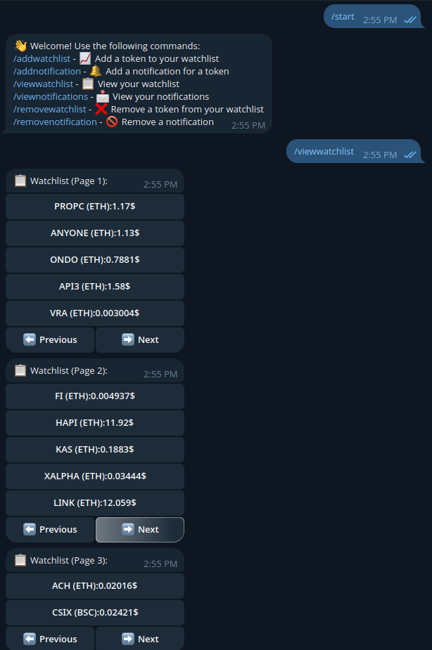

# Crypto Tracker Telegram Bot

  <!-- Add a relevant image -->

## Overview

The Crypto Tracker Telegram Bot allows users to monitor cryptocurrency prices, maintain a personalized watchlist, and set notifications for price changes. The bot is built using the Telebot library and interacts with users through intuitive commands and messages.

## Features

- **Add Tokens to Watchlist**: Track your favorite cryptocurrencies by adding them to your watchlist.
- **Set Price Notifications**: Get notified when a cryptocurrency's price changes by a specified percentage.
- **View Watchlist**: Check the current prices of the tokens in your watchlist.
- **View Notifications**: Review your active price notifications.
- **Remove Tokens and Notifications**: Manage your watchlist and notifications with ease.

## Commands

| Command                  | Description                                             |
|--------------------------|---------------------------------------------------------|
| **/start** or **/help**  | Displays a welcome message and a list of available commands. |
| **/addtoken**            | Starts the process of adding a new token to your watchlist by selecting the network and entering the token's contract address. |
| **/addnotification**     | Allows you to set a notification for a token based on price changes. |
| **/viewwatchlist**       | Shows your current watchlist with live prices.        |
| **/viewnotifications**   | Lists all your active notifications.                   |
| **/removewatchlist**     | Removes a specified token from your watchlist.         |
| **/removenotification**  | Removes a specific notification.                       |

## Installation

### Prerequisites

- Python 3.x
- Telegram Bot API token (obtainable via the BotFather on Telegram)

### Setup

1. **Clone the Repository:**

    ```sh
    git clone https://github.com/your-username/crypto-tracker-bot.git
    cd crypto-tracker-bot
    ```

2. **Install Dependencies:**

    ```sh
    pip install -r requirements.txt
    ```

3. **Create Configuration Files:**

    - `WATCHLIST_FILE`: A JSON file to store the user's watchlist.
    - `NOTIFICATIONS_FILE`: A JSON file to store the user's notifications.

4. **Run the Bot:**

    ```sh
    python3 bot.py
    ```

## Usage


1. **Start the Bot**: Send `/start` or `/help` to get a list of available commands.
2. **Add a Token**: Use `/addtoken` and follow the prompts to add a token to your watchlist.
3. **Set Notifications**: Use `/addnotification` and specify the conditions for notifications.
4. **View and Manage Watchlist**: Use `/viewwatchlist` to see the current prices and `/removewatchlist` to remove tokens.
5. **Manage Notifications**: Use `/viewnotifications` to see active notifications and `/removenotification` to remove them.

## Logging

The bot logs important events and errors to `crypto_tracker.log`. This file can be used to track bot activity and diagnose issues.

## Contribution

Feel free to fork this repository and submit pull requests. For major changes, please open an issue first to discuss what you would like to change.

## Contact

For any questions or support, please open an issue or contact [sp1r4.work@gmail.com](mailto:sp1r4.work@gmail.com).

